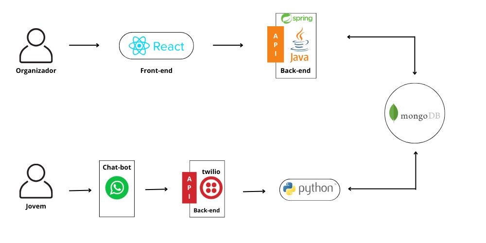

# Helipa Eventos

## Direito ao Acesso à Cidade aos Jovens de Heliópolis - Grupo 1

## Aplicação

Front End em React JS + Vite

## Login

E-mail: avaliador@gmail.com

Senha: 1234

## Descrição do Problema

Os jovens de Heliópolis, durante seu tempo de lazer, ficam limitados à espaços dentro da comunidade. Entretanto, em uma região tão vasta, existem diversas oportunidades de lazer ao entorno do território, que podem ampliar essa população nas suas opções de diversão. Os pontos mais importantes observados pelo grupo foram a falta de incentivo à cultura e o desinteresse populacional, ponto crucial, dado que eventos acontecem a todo momento na região.

## Proposta de Solução

Desenvolver um sistema onde organizadores de eventos possam cadastrar eventos por meio de um site, e os usuários possam visualizar esses eventos através de um chat-bot no WhatsApp, com a possibilidade de filtrar por data, região, categoria e preço. Dessa forma, buscamos ampliar a divulgação de eventos dentro da comunidade, através de um chatbot, de forma a ampliar as opções dos jovens e incentivar a busca pela informação.

## Estrutura do Projeto

1. Arquivo principal é o `App.jsx`;
2. Diferentes páginas estão organizadas nas pastas `common`, `eventos` e `usario`.

## Instruções de Execução

[Site do Deploy Geral](www.helipaeventos.com.br)
[Site do Deploy](https://acesso-1-front.vercel.app/)

Caso queira testar em sua máquina:

1. Clone o [repositório](https://github.com/insper-classroom/acesso-1-front.git) em sua máquina.
2. Instale o Node.js: [Download Node.js](https://nodejs.org/en/download/prebuilt-binaries)
3. Instale o Vite: [Vite.js](https://vitejs.dev/)
4. Dentro do repositório, execute o comando: `npm install`
5. Instale as dependências listadas no arquivo `package.json`
6. Execute o comando: `npm run dev`

## Funcionalidade

Esta é a interface front-end de uma plataforma que permite aos organizadores cadastrar e gerenciar eventos, facilitando aos usuários a busca por esses eventos através de um chatbot no WhatsApp.

## Arquitetura

## Slides e Back Log

1. [Slides usados na Apresentação do Projeto](https://www.canva.com/design/DAGHde_rdRk/5zpKa41VQEeIy4j-Ag62dw/edit?utm_content=DAGHde_rdRk&utm_campaign=designshare&utm_medium=link2&utm_source=sharebutton);

2. Organização no Notion:

- [Geral](https://robust-ferry-149.notion.site/Helipa-Eventos-c256e1219d024f8a9d281c8283d464b7)

- [Quadro de Tarefas - Backend](https://robust-ferry-149.notion.site/6a9685b7ac1243c986d93ba0e61ff3fb?v=aba3b9f0d8b14446b7ab1b906f54d44e)

- [Quadro de Tarefas - Frontend](https://robust-ferry-149.notion.site/db6090be580d4c29ac8c973e5774ed70?v=91457808434e4fc6bb2b18487750a2d6)

- [Quadro de Tarefas - ChatBot](https://robust-ferry-149.notion.site/3937aaa663d345e09094571fcbd399ad?v=3162f98470984dbd8b0a0800e8f51afa)

- [Quadro de Tarefas - Entregas](https://robust-ferry-149.notion.site/10fbd338436a420fab177b0edd262bcc?v=46b2d50c24fb4aeb9f2e6850b15cd153)

## Referências

1. Auxílio do [ChatGPT](https://chatgpt.com/) para dúvidas com o código;
2. Contribuição do professor [Eduardo Felipe Zambom Santana](https://github.com/ezambomsantana).

## Desenvolvedores

Projeto desenvolvido por [Ana Helena Caiafa](https://github.com/anahc3), [Deena El Orra](https://github.com/DeenaElOrra), [Guilherme Kaidei](https://github.com/guikaidei), [Gustavo Ribolla](https://github.com/ribollequis87), [Henrique Junqueira](https://github.com/henriquemjf) e [Thiago Penha](https://github.com/tpenha05).